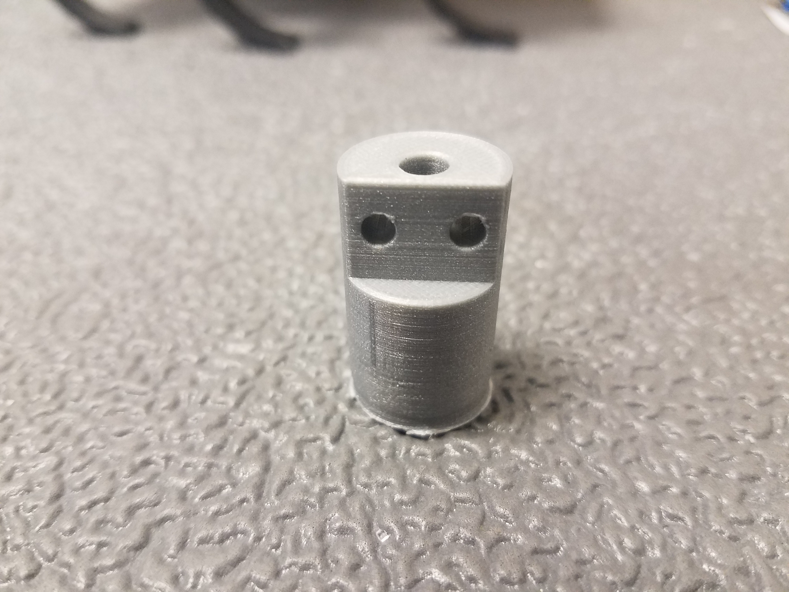
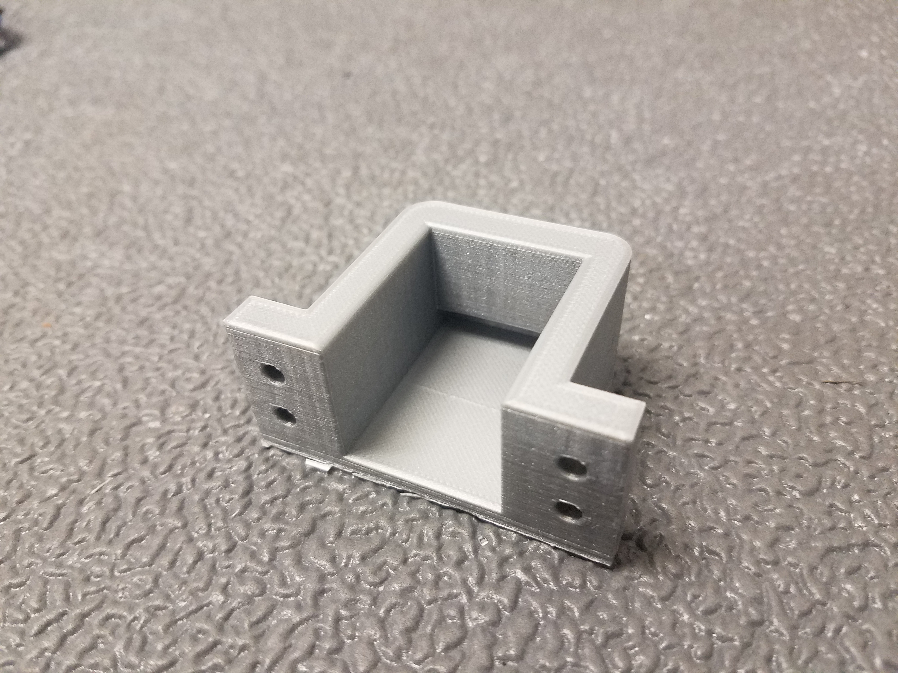

Note that while photographs do not reflect the most recent 3D printed parts as of 1/2020, the assembly instructions are largely unaffected.

# Required Equipment

* 3D printer
* Laser cutter (or saw + hand drill)
* File, edge trimmer, or other tool for cleaning up 3D printed parts
* Soldering iron
* 2 mm hex head allen key
* Small Phillips head screwdriver
* Pliers
* M3 x 0.5 mm tap

# MiniRHex Assembly Instructions

1. Solidworks files available in /CAD
 * Any updated or changed SolidWorks parts will be uploaded here

2. Look at the MiniRhexHardware file to see the needed parts and links to the items.
  * McMaster: M3 locknuts, button head screws, spacers, and 3mm acrylic
  * Amazon: Battery, Plastidip, charger, velcro straps for battery, and battery connectors
  * Robotis: Main board, Dynamixels, Bluetooth(optional)

3. Print the following parts. .stl files can be found in /CAD/STL. It is recommended that you print with PLA, but not required. Print all parts with support, and at least 20% infill. You may want a brim on your parts to ensure good bed adhesion.
 * 6 servo sleeve parts (servo sleeve.STL), for best results print with the back side on the build plate.
 * 4 shaft-edge parts (shaft-edge.STL), for best results print with the circular crossection flush with the buildplate.
 * 2 shaft-mid parts (shaft-mid.STL), for best results print with the circular crossection flush with the buildplate.
 * 1 battery case part (Battery case.STL), for best results print with base on the buildplate
 * 6 leg parts (leg.STL)

 The expected amount of PLA used to print is around:
 * 6 servo sleeve parts at (11g each)(6 sleeves) = 66g
 * 4 shaft-edge parts at (3g each)(4 shaft edges) = 12g
 * 2 shaft-mid parts at (5g each)(2 shaft-mid parts) = 10g
 * 1 battery case part (17g each)(1 case) = 17g
 * 6 leg parts (2g each)(6 legs) = 12g

 The total amount adds to 117g, but will vary depending on your printing parameters.

 After printing, ensure that you remove the supports inside the prints before moving on. There will be support material in the shaft pieces, servo sleeves, and under the battery case. They should look like this:

 

 

 

 All in all, the parts should look as follows:

 
 
 Make sure to trim any excess material from the parts.

4. Open base.sldprt and save as a .dxf file. Use this file to laser cut 3-mm thick acrylic to
serve as the foundation for the robot. If you wish, you can substitute wood for acrylic, but make sure the thickness matches, as the screw length is based off of the base thickness. If you do not have access to a laser cutter, print out the DXF file of the base plate on printer paper and use it as a guide to hand drill holes with a 3.4 mm bit into thin wood.

Check to make sure the screws fit through the holes. If not, drill them out before moving on.

5. Prepare the mainboard for use.
 * Solder the battery connector onto one positive pinhole and one negative pinhole
  for power. The location on the board is shown below:

  

6. First, we connect the battery case and mainboard to the foundation, with the USB port facing outwards (see step 16. for complete MiniRHex layout). 

Before mounting the battery case to the base, thread one 8"x1/2" velcro strap through the holes in the bottom so that the strap runs under the case.
 * Connections:
    * Battery case: M3 button head x 10 mm, M3 nut. The lock nuts should seat into the hex cutouts inside the battery case.
    * Mainboard: M3 spacer, M3 button head x 10 mm, M3 lock nut. Place the locknuts above the mainboard, not below the base.
  * Battery case is near the center of the foundation.
  * The mainboard’s micro-USB port should face out.
  * The mainboard will be towards the front of the robot.

  For attatching the mainboard, place spacer in between the mainboard and the acrylic base, then the nut on top of the mainboard.

7. Next, prepare the legs by using Plastidip (either dip or spray) and coating around 75% of each of the six
legs until a high friction surface forms on each leg.
  * Between each coat, let dry for at least one hour.
  * Make sure the dip is evenly coated around the leg.
  * Do not cover the through holes for the screws.

  The legs should look as follows:

  

8. Connect four of the six legs to edge shafts (shorter shafts).

   Check that the legs sit flush on the shafts when the two mounting holes are aligned. If not, use a file or edge trimmer to clean the edge of the part until they do.

   Next, tap the leg shafts using a M3 tap. If you do not have a tap, you may be able to thread the screw directly into the part - do so very carefully to avoid stripping.

   Connect the legs to leg shafts using the 15 mm long M3 screws.

  * Align the leg through holes with the holes on the cut-out portion of the shaft.
  * Ensure that the leg is flush and lays flat against the shaft.
  * Connection: M3 socket head x 15 mm
  * Ensure that there are two legs facing each direction as shown below

9. Connect the other two legs to the mid shafts (longer shaft).

   Again, check that the legs sit flush on the shafts and tap the leg shafts before inserting screws.

  * Align the leg through holes with the holes on the cut-out portion of the shaft.
  * Ensure that the leg is flush and lays flat against the shaft.
  * Connection: M3 socket head x 15 mm
  * For one of the two connections, be sure to switch the orientation of the leg
  as shown below.

  

10. Connect each shaft-leg apparatus to the Dynamixel XL-320 servo motor.
  * Orientation: Make sure the half circle each leg forms faces the front of the robot:
  towards the side with the mainboard.
  * Detach the center screw in the servo horn, and pry off the horn itself.
    * The horn looks like a small, black plastic cylinder with 4 holes.
  * On the side of the horn there will be tick mark, and on the opposite side, two tick marks. When aligning the legs into the servo horn, ensure that when placing the servo horn back on the motor that the single tick mark is facing downwards, towards the bottom of the servo.
  * Align the 4 through holes on the servo horn with the 4 extruded pieces on the shaft
  face (the shaft length doesn’t matter).
  * Align the horn (now connected to the leg apparatus) to its key on the body of the servo.
    * Once the horn is flush against the body, connect the horn/shaft/leg apparatus
    to the servo motor.
    * Connection: M2.5 x 25 mm bolts from McMaster
  * Be sure to align the bottom slots!
  

11. Slide each servo into a servo sleeve.

Before connecting each servo sleeve to the foundation, configure each of the servo IDs by connecting them with the provided wires individually to the mainboard.

Instructions on how to [Configure Servo IDs](https://github.com/robomechanics/MiniRHex#configure-servo-ids).

12. Connect each servo sleeve to the foundation.
  * Orientation: Be sure all legs face forward (semicircle faces the mainboard).
  * Connection: M3 button head x 10 mm, M3 locknut

The locknuts should seat into the hex cutouts on the servo sleeves.

13. Connect the servos to the mainboard.
  * Connect such that no wires interfere with leg rotation.
14. Charge battery(ies) and check voltage(s).
  * Maximum voltage:  8.4V
  * Charge if below:  7.0V
  * Dispose if below: 5.0V

15. Upload code using the micro-USB port. More detailed instructions can be found [here](https://robomechanics.github.io/MiniRHex).

16. Take electronic wires that come with the servos, and connect them like below

