# Preparation
1. Acquire the following equipment.
   * 3D printer + PLA filament
   * Wire cutters
   * Small Phillips head screwdriver
   * Small flat head screwdriver (basic users only)
   * Soldering station (advanced users only)

2. Purchase necessary components from the [Hardware List](/HardwareList).
   * Amazon: Arduino MKR, Battery, Plastidip, JST Connector, 5V UBEC, Velcro Straps, LiPo Voltage Monitor, and LiPo Safe Bag
   * Robotis: Dynamixel Servos, Arduino Shield

# Fabrication
1. 3D print the following parts. STL files can be found in [CAD/STL](/CAD/STL) and SolidWorks files are provided in [CAD](/CAD) to allow modification if needed. It is recommended to print with PLA, using the provided settings. Users of Prusa i3 MK3S 3D printers can also use the PrusaSlicer project files and g-code in the [CAD/Prusa](/CAD/Prusa) folder. Make sure to remove any support material from the legs before assembly.

   * 1 robot body ([robot_body.STL](/CAD/STL/robot_body.STL)): 15%-20% infill, no supports
   * 2 standard left front/back legs ([standard_leg_left.STL](/CAD/STL/standard_leg_left.STL)): 100% infill, support on build plate
   * 2 standard right front/back legs ([standard_leg_right.STL](/CAD/STL/standard_leg_right.STL)): 100% infill, support on build plate
   * 1 standard left middle leg ([standard_leg_left_middle.STL](/CAD/STL/standard_leg_left_middle.STL)): 100% infill, support on build plate
   * 1 standard right middle leg ([standard_leg_right_middle.STL](/CAD/STL/standard_leg_right_middle.STL)): 100% infill, support on build plate
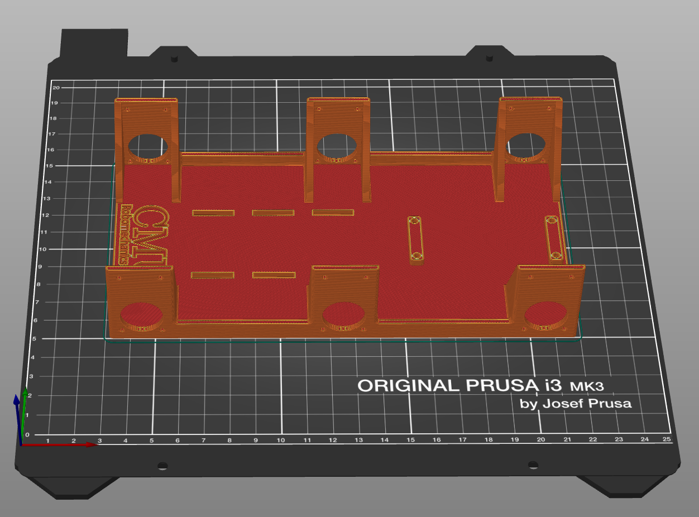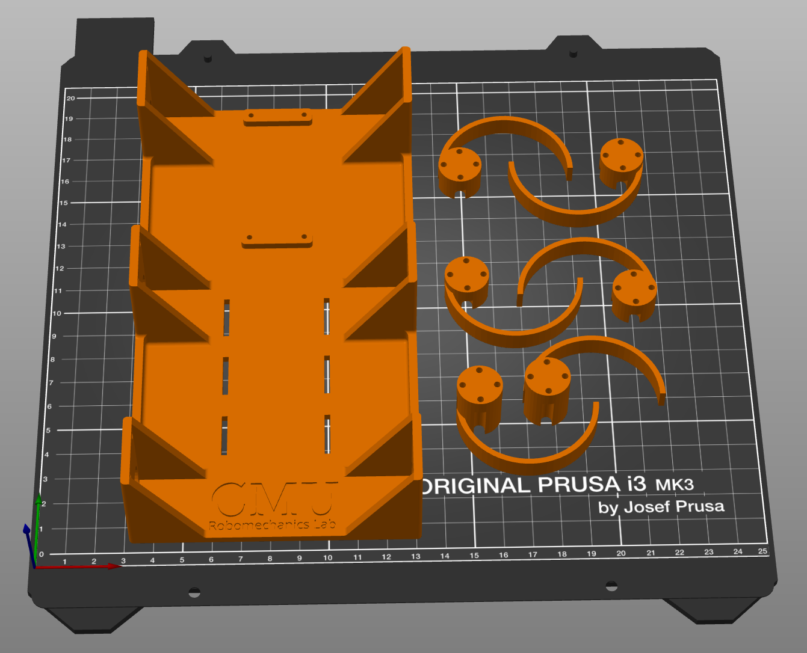  

   Certain users may desire to frequently switch out different legs, for which a quick-connect leg design is also available. The quick-connect legs are faster to swap, but less durable. Quick-connect leg users should instead print the following.

   * 1 robot body ([robot_body.STL](/CAD/STL/robot_body.STL)): 15%-20% infill, no supports
   * 2 quick-connect left front/back legs ([quick_connect_leg_left.STL](/CAD/STL/quick_connect_leg_left.STL)): 100% infill, support on build plate
   * 2 quick-connect right front/back legs ([quick_connect_leg_right.STL](/CAD/STL/quick_connect_leg_right.STL)): 100% infill, support on build plate
   * 1 quick-connect middle left leg ([quick_connect_leg_left_middle.STL](/CAD/STL/quick_connect_leg_left_middle.STL)): 100% infill, support on build plate
   * 1 quick-connect middle right leg ([quick_connect_leg_right_middle.STL](/CAD/STL/quick_connect_leg_right_middle.STL)): 100% infill, support on build plate
   * 6 quick-connect hubs ([quick_connect_hub.STL](/CAD/STL/quick_connect_hub.STL)): 100% infill, support on build plate  
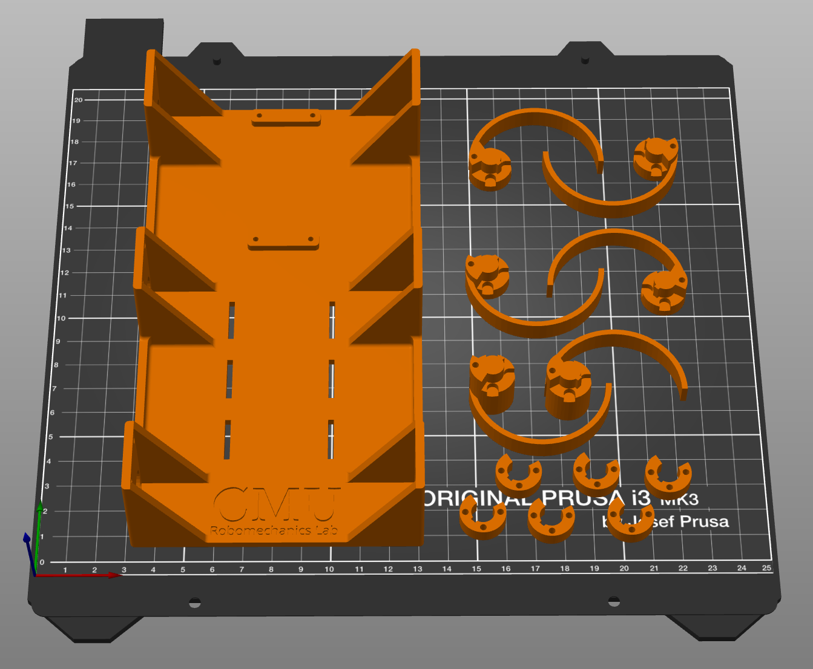

   Several additional leg variants exist, all compatible with the quick-connect system. For each additional set of legs you will need to 3D print 4 front/back legs and 2 middle legs of the appropriate type (but no additional hubs are needed).

2. Add Plastidip to legs for increased friction.
   * Use Plastidip (either dip or spray) to coat around 75% of each of the six legs until a high friction surface forms on each leg.
   * Between each coat, let dry for at least one hour.
   * Make sure the dip is evenly coated around the leg.
   * Do not cover the through holes for the screws.
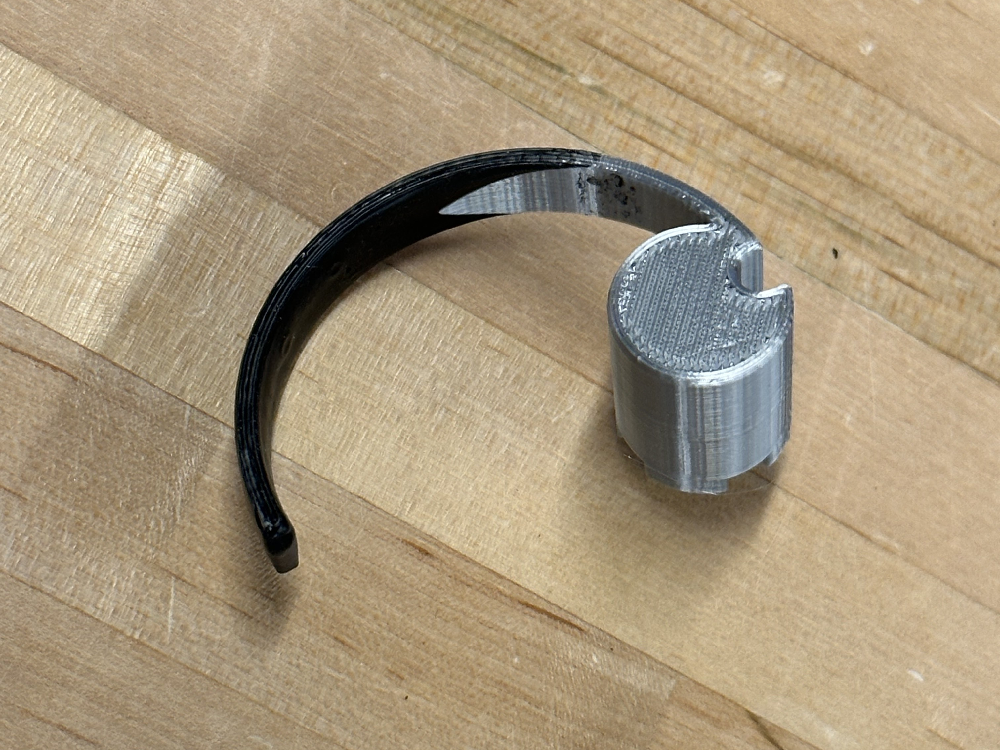

# Assembly
1. Locate and sort motor screws.
    * Each of the motors comes with a set of screws. Open all six motor packages and sort into short and long screws.
    * You will need 4 short screws (M2x6) and 48 long screws (M2x8) to assemble the robot.
  
2. Mount the servos to the robot body.
    * Each motor requires 4 long screws. The screws will tap directly into the motor's plastic, so do not over tighten them.

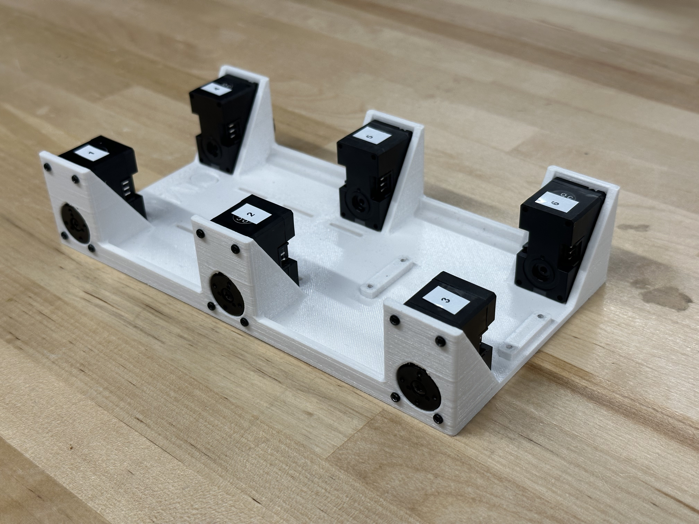

3. Trim the leads on the Arduino shield.
    * The Robotis Arduino shield comes with leads that are too long. Using wire cutters, trim them to within 1-2mm of the board.
    * Only trim the leads on the shield, not the Arduino itself!

4. Attach the JST connector to the Arduino shield.
    * Basic users can insert the red and black wires into the green screw terminals (red goes into the + side, and black goes into the - side), then tighten them using the flat head screwdriver. Do not swap the colors, or it could severely damage the electronics!
    * Advanced users can instead solder the wires directly to the Arduino shield for a more robust connection, as pictured.

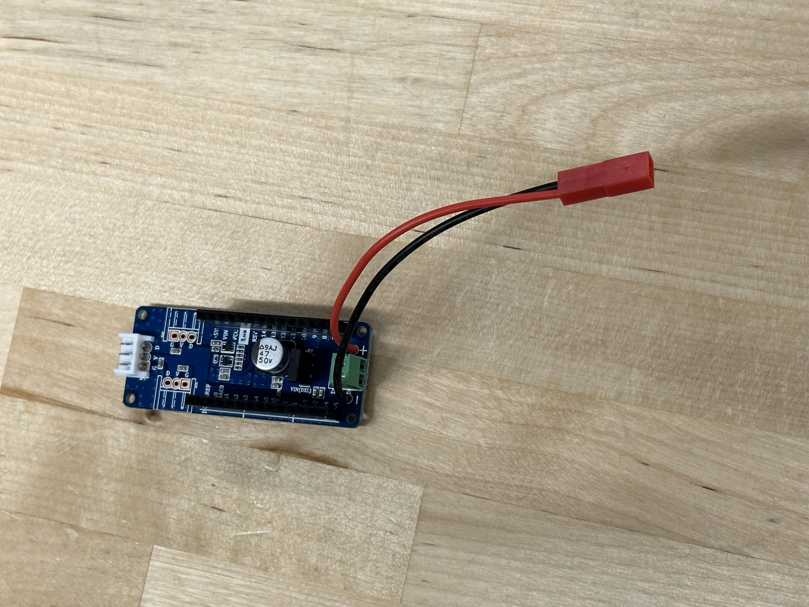

5. Mount the Arduino shield to the robot body.
    * You will needs 4 short screws. The screws will tap directly into the motor's plastic, so do not over tighten them.
    * The screw terminals and JST connector should face the center of the robot body.

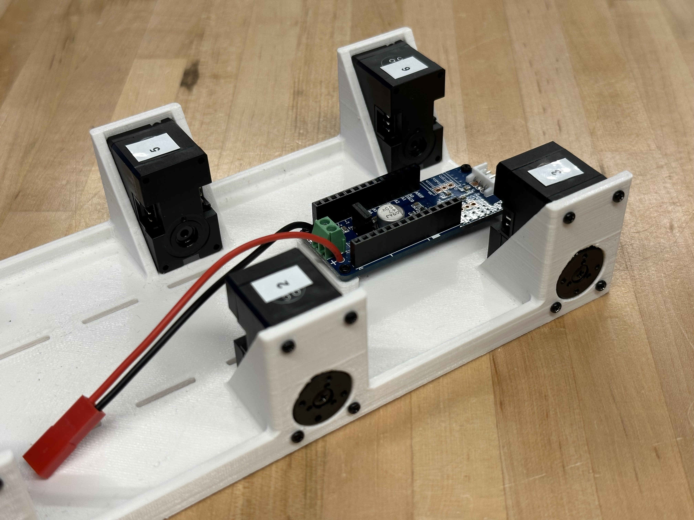

6. Stack the Arduino on top of the Arduino shield.
    * The header pins should line up, with the micro USB port facing the edge of the robot.

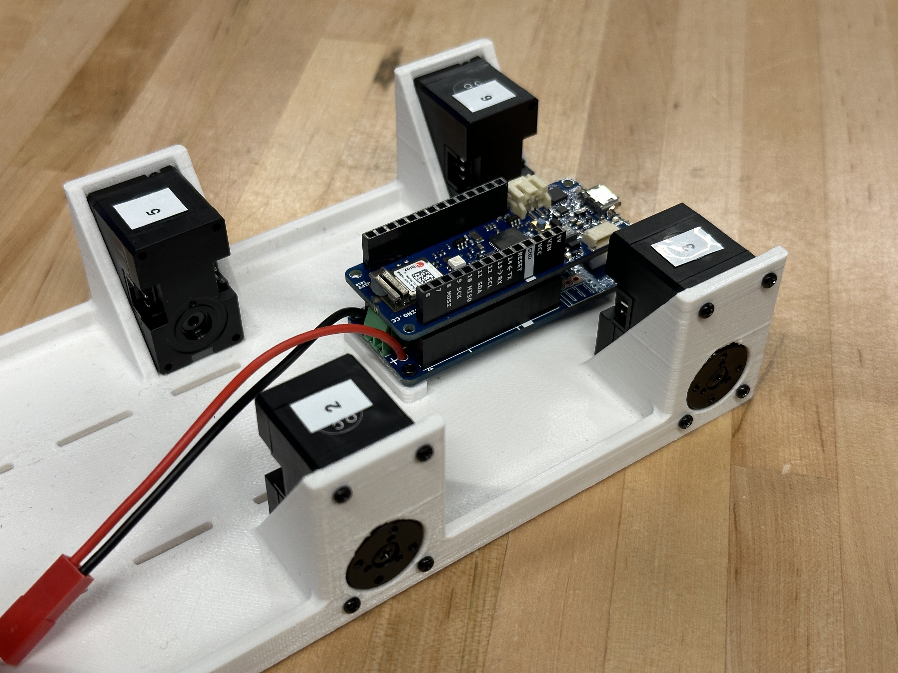

7. Wire up the motors using the included Dynamixel cables.
    * The motors should be daisy-chained to each other in series, with the Arduino shield as one end of the chain.
    * A suggested ordering is: Arduino Shield -> Motor 6 -> Motor 5 -> Motor 4 -> Motor 1 -> Motor 2 -> Motor 3.
    * Use either the included wire wraps or zip ties to manage the wires, as pictured.

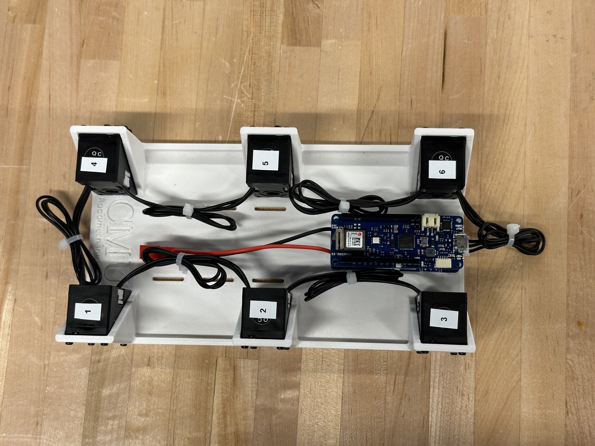

8. Attach the 5V UBEC to the JST connector.
    * The JST connector is not reversible, so it will only connect if oriented correctly (red to red, black to black).

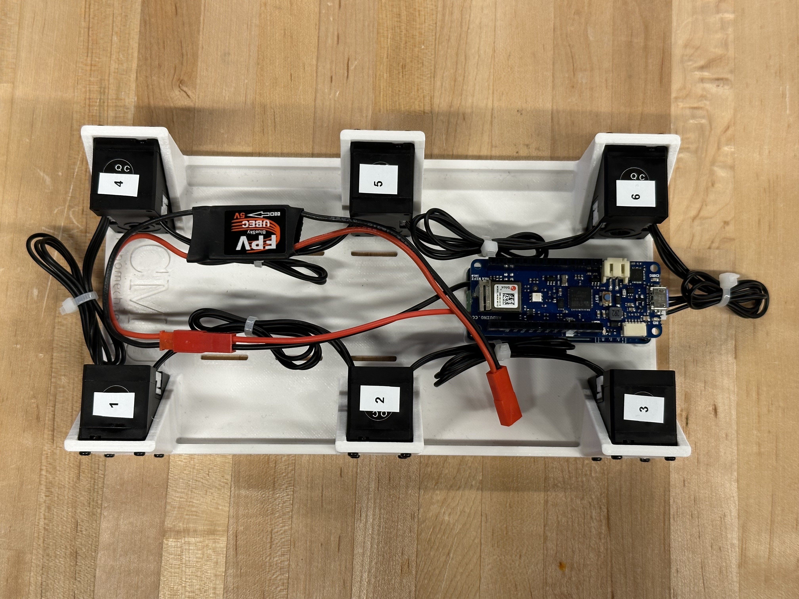

9. Thread the Velcro straps through the slits in the robot body.
    * Ensure the ends of each strap come out on top of the robot body for ease of access.

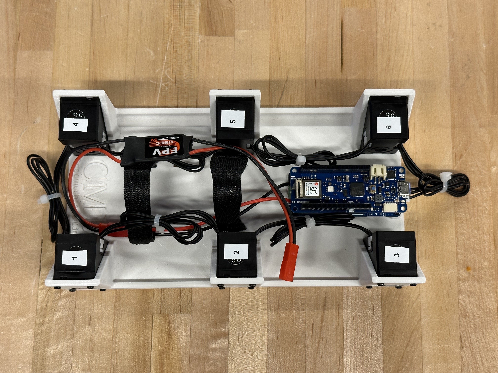

10. Align each servo horn.
    * Each servo horn has 3 small circular indents forming a triangle. Rotate the motor by hand until the circle closest to a screw mounting hole is at the top.

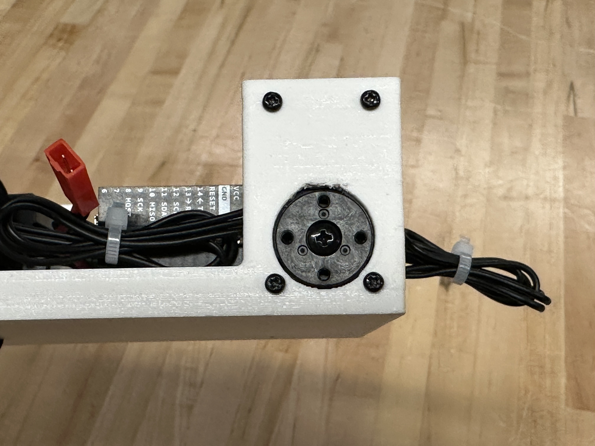

11. Mount a quick-connect hub to each servo horn (quick-connect leg users only).
    * Each quick-connect hub requires 3 long screws. The screws will tap directly into the motor's plastic, so do not over tighten them.
    * Ensure that the opening in the hub faces upwards, and the little notch in the hub is on the side closer to the front of the robot (the side without the Arduino).

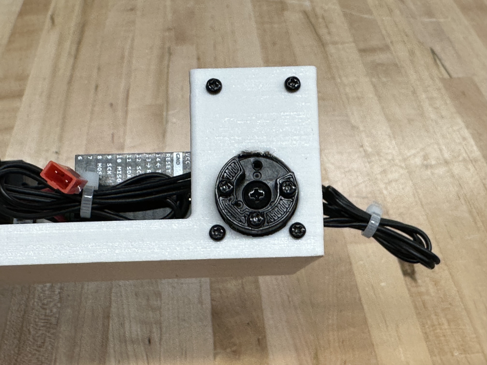

12. Mount a leg to each servo horn.
    * Quick-connect legs require 1 additional long screw, while standard legs require 4 long screws. The screws will tap directly into the motor's plastic, so do not over tighten them.
    * The middle legs extend out further from the robot, to prevent collisions between neighboring legs.
    * Ensure that the curved side of each leg faces the rear of the robot (the side with the Arduino) and the end of the leg is directly below the robot (with the servo horn aligned as in step 10), as pictured for both leg types.

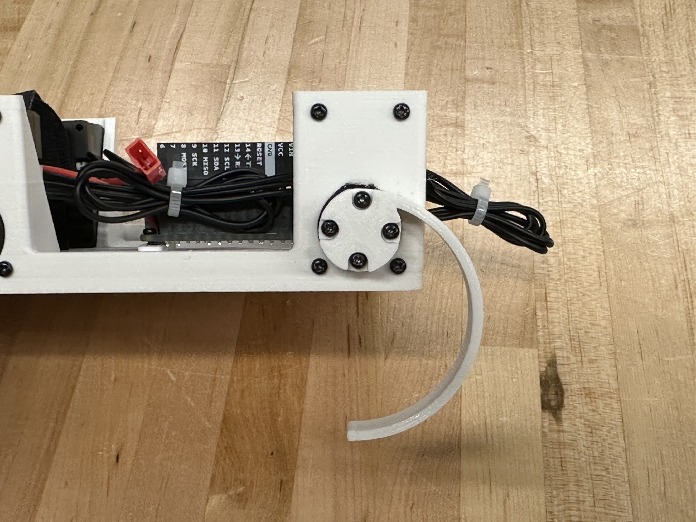
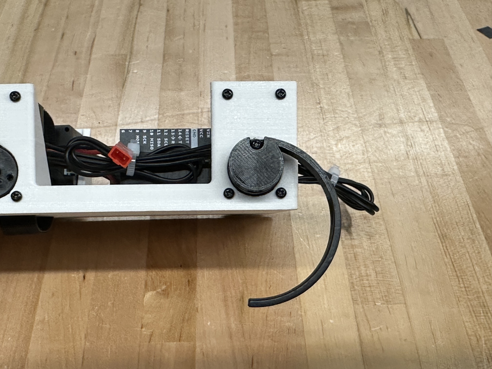
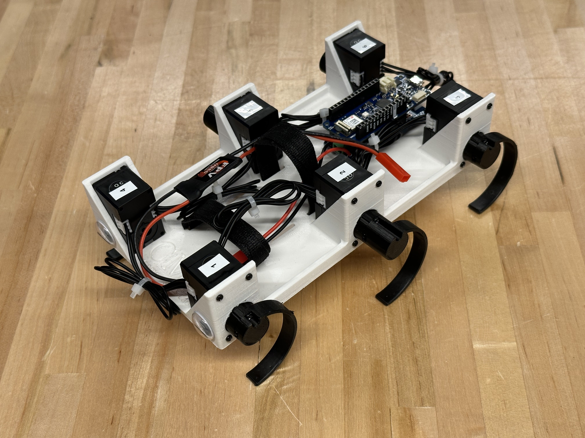

# Battery Usage
1. Fully charge a battery.
    * **WARNING: Improper handling of LiPo batteries is very dangerous and can cause fires.**
    * Never allow a battery to charge unsupervised.
    * When not in use, always store batteries in a LiPo safe bag or fireproof cabinet.
    * Carefully follow all instructions from the manufacturer of the battery and charger.
    * Safely dispose of batteries according to manufacturer instructions if the battery becomes puffy or if the voltage drops below 5V. Do not just throw LiPo batteries in the trash!

2. Connect the LiPo voltage monitor to the battery. Never run the robot without the voltage monitor connected!
    * The black wire on the white battery connector should plug into the minus port (far left) of the voltage monitor.
    * It is advised to cover the top of the voltage monitor with a finger while connecting it to the battery, to dampen the loud beep it produces.
    * The voltage monitor will sound an alarm if the battery dips below a safe level. When this happens, immediately unplug the battery from the robot and recharge it. Continuing to operate the battery below the safe voltage level will cause permanent damage, and possibly start a fire.
    * The maximum battery voltage is 8.4V, charge the battery if it falls below 7.0V, the alarm will sound at 6.6V, and dispose of the battery if it falls below 5.0V.

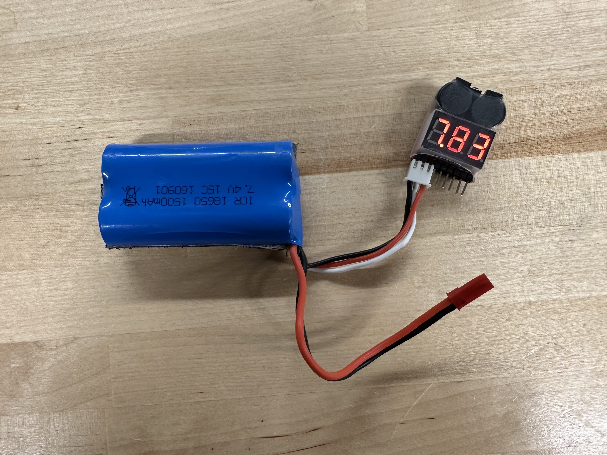
   
3. Connect the battery to the robot.
    * Slide the battery through the Velcro straps, then tighten them to hold it in place.
    * Connect the battery to the 5V UBEC. Never connect the battery directly to the Arduino shield!

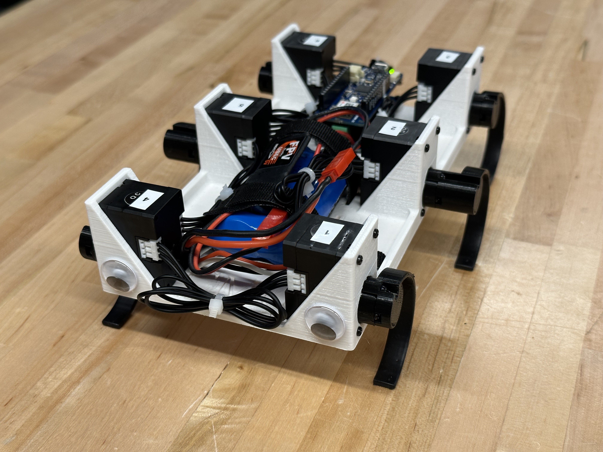

# Software Setup
1. Install the Arduino IDE and download the MiniRHex repository.
    * Instructions are available at [Install Software](/#install-software).

2. Configure the servo IDs for each leg. The correct Dynamixel servo positions are:
    - ID 1 = front left
    - ID 2 = center left
    - ID 3 = rear left
    - ID 4 = front right
    - ID 5 = center right
    - ID 6 = rear right

    To set the Dynamixel ID numbers, follow these steps:
    1. Disconnect all Dynamixel servos except for the one in position 2
    2. Open the Arduino IDE and check that under "Tools":
       - "Board" is set to "Arduino MKR WiFi 1010" (under "Arduino SAMD (32-bits ARM Cortex-M0+) Boards")
       - "Port" is set to the correct COM port, e.g. "COM# (Arduino MKR WiFi 1010)"
    3. Select "File" > "Examples" > "DynamixelShield" > "Basic" > "id" to open the ID-setting example script
    4. Find the line "new_id = DEFAULT_DXL_ID;" and delete it or comment it out: "// new_id = DEFAULT_DXL_ID;"
    5. Find the line "new_id = 100;" and edit it to "new_id = 2;"
    6. Upload code to the robot (the circular button near the top left with an arrow pointing to the right)
    7. Open the Serial Monitor in the Arduino IDE (the circular button in the top right with a magnifying glass) and verify the ID has been changed
    8. Unplug the Dynamixel and repeat from step 5 with the Dynamixel servos in positions 3, 4, 5 and 6 (setting "new_id = 3;" for ID 3, etc.)

3. Upload code using the micro-USB port. You can now operate the robot using the Serial Monitor or the web interface!
    * Instructions are available at [Operating Instructions](/#operating-instructions).

4. When finished, unplug the battery and store it in a fireproof container. Never leave a battery in the robot!
