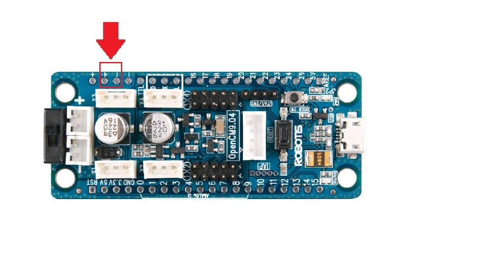

# MiniRHex Assembly Instructions

1. Solidworks files available in /CAD
 * Any updated or changed SolidWorks parts will be uploaded here
  
2. Look at the MiniRhexHardware file to see the needed parts and links to the items.
  * McMaster: M3 locknuts, button head screws, and spacer; 3mm acrylic
  * Amazon: Battery, Plastidip, charger, and battery connectors
  * Robotis: Main board, Dynamixels, Bluetooth(optional)
  
3. If you have access to an Ultimaker 3, simply upload and print using the extended printer gcode, in /CAD/STL, called     MiniRhex_full_print_compressed.gcode.gz.
   Otherwise, print the following (PLA), .stl files can be found in /CAD/STL
 * 6 servo sleeve parts (servo sleeve.STL), for best results print with the back side on the build plate 
 * 4 shaft-edge parts (shaft-edge.STL)
 * 2 shaft-mid parts (shaft-mid.STL)
 * 1 battery case part (Battery case.STL)
 * 6 leg parts (leg.STL)
 
 The expected amount of PLA used to print is around:
 * 6 servo sleeve parts at (11g each)(6 sleeves) = 66g
 * 4 shaft-edge parts at (3g each)(4 shaft edges) = 12g
 * 2 shaft-mid parts at (5g each)(2 shaft-mid parts) = 10g
 * 1 battery case part (17g each)(1 case) = 17g
 * 6 leg parts (2g each)(6 legs) = 12g
 
 The total amount adds to 117g.
 
 After printing, there are supports inside the servo sleeves, shaft-edge parts and shaft-mid parts. Ensure that you remove the supports inside the prints before moving on. They should look like this:
 
 
 
 
 
 
 
 All in all, the parts should look as follows:
 
 ![Everything] (Images/final_all)
  
4. Open base.sldprt and save as a .dxf file. Use this file to laser cut 3-mm thick acrylic to
serve as the foundation for the robot.

Check to make sure the screws fit through the holes. If not, drill them out before moving on.

5. Prepare the mainboard for use.
 * Solder the battery connector onto one positive pinhole and one negative pinhole
  for power. The location on the board is shown below:
  
  
  
6. First, connect the battery case and mainboard to the foundation, with the USB port facing outwards (see step 16. for complete MiniRHex layout).
 * Connections:
    * Battery case: M3 button head x 10 mm, M3 nut
    * Mainboard: M3 spacer, M3 button head x 10 mm, M3 lock nut
  * Battery case is near the center of the foundation.
  * The mainboard’s micro-USB port should face out.
  * The mainboard will be towards the front of the robot.
  
  Place nuts on top of the board so it doesn't interfere with MiniRHex's movement. It is not recommended to place the nut underneath the board.
  
  For attatching the mainboard, place spacer in between the mainboard and the acrylic base, then the nut on top of the mainboard.
  
7. Next, prepare the legs by using Plastidip (either dip or spray) and coating around 75% of each of the six
legs until high friction surface forms on each leg.
  * Between each coat, let dry for at least one hour.
  * Make sure the dip is evenly coated around the leg.
  * Do not cover the through holes for the screws.
  
  The legs should look as follows:
  
  
  
8. Connect four of the six legs to edge shafts (shorter shafts).
   
   Due to the nature of 3-D printing, you may need to file down your leg shafts in order for the legs to sit comfortably or drill out the holes in the legs.
   
   Next, tap the leg shafts using a m3 tap.
   
   Connect the legs to ethe shafts using a m3 screw.

  * Align the leg through holes with the holes on the cut-out portion of the shaft.
  * Ensure that the leg is flush and lays flat against the shaft.
  * Connection: M3 socket head x 10 mm
  * Ensure that there are two legs facing each direction as shown below
  
9. Connect the other two legs to the mid shafts (longer shaft).

   Similarly, you may need to first file and drill the leg shafts.
   
   Again, tap the leg shafts before inserting screws. 
   
  * Align the leg through holes with the holes on the cut-out portion of the shaft.
  * Ensure that the leg is flush and lays flat against the shaft.
  * Connection: M3 socket head x 10 mm
  * For one of the two connections, be sure to switch the orientation of the leg
  as shown below.
  
  
  
10. Connect each shaft-leg apparatus to the Dynamixel XL-320 servo motor.
  * Orientation: Make sure the half circle each leg forms faces the front of the robot:
  towards the side with the mainboard.
  * Detach the center screw in the servo horn, and pry off the horn itself.
    * The horn looks like a small, black plastic cylinder with 4 holes.
  * On the side of the horn there will be tick mark, and on the opposite side, two tick marks. When aligning the legs into the servo horn, ensure that when placing the servo horn back on the motor that the single tick mark is facing downwards, towards the bottom of the servo.
  * Align the 4 through holes on the servo horn with the 4 extruded pieces on the shaft
  face (the shaft length doesn’t matter).
  * Align the horn (now connected to the leg apparatus) to its key on the body of the servo.
    * Once the horn is flush against the body, connect the horn/shaft/leg apparatus
    to the servo motor.
    * Connection: M2.5x25 bolts from McMaster

11. Slide each servo into a servo sleeve.

Before connecting each servo sleeve to the foundation, configure each of the servo IDs by connecting them with the provided wires individually to the mainboard. 

Instructions on how to [Configure Servo IDs](https://github.com/robomechanics/MiniRHex#configure-servo-ids).

12. Connect each servo sleeve to the foundation.
  * Orientation: Be sure all legs face forward (semicircle faces the mainboard).
  * Connection: M3 button head x 10 mm, M3 nut
  
  Again, it is recommended that the M3 nuts are placed on top of the board as opposed ot the bottom of the board.
  
13. Connect the servos to the mainboard.
  * Connect such that no wires interfere with leg rotation.
14. Charge battery(ies) and check voltage(s).
  * Maximum voltage:  8.4V
  * Charge if below:  7.0V
  * Dispose if below: 5.0V

15. Upload code using the micro-USB port. More detailed instructions can be found [here](https://robomechanics.github.io/MiniRHex).

16. Take electronic wires that come with the servos, and connect them like below

 
 
