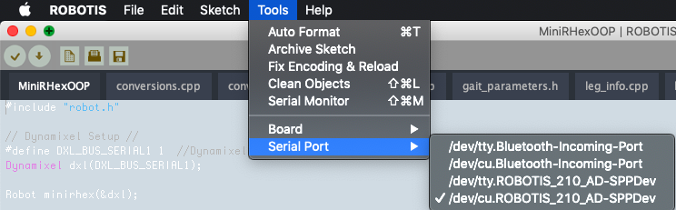
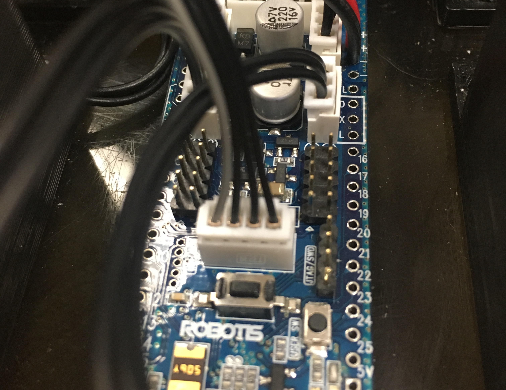
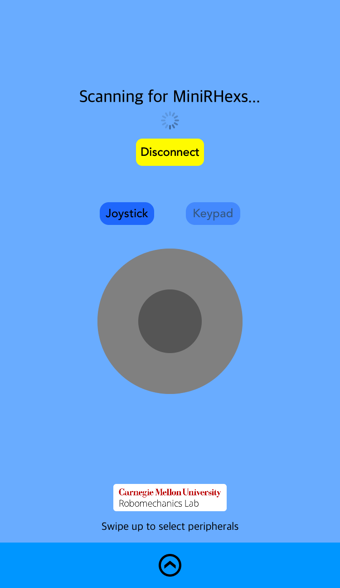

# Bluetooth Instructions

## Laptop/PC control

### Hardware:

The MiniRHex uses the [BT210 bluetooth module](http://www.robotis.us/bt-210/) from Robotis to pair with a laptop or personal computer.

### Steps:
1. Attach the BT210 to the MiniRHex

2. Turn on the MiniRHex by flipping the switch and press the reset button (the black rectangular button)

3. Pair your PC with the board and open the Arduino IDE or the OpenCM IDE

4. Go to Tools->Serial Port and select the bluetooth connection (should have ROBOTIS_210 somewhere in the name)

5. Open the Serial Monitor

6. Now type in commands! (see [bluetooth_commands.txt](bluetooth_commands.txt) for information on the commands)

## Mobile phone control

### Hardware:

The MiniRHex uses the [BT410 bluetooth module](http://www.robotis.us/bt-410/) from Robotis to pair with a laptop or personal computer. UNFORTUNATELY, YOU CANNOT USE THE BT210 FOR PAIRING WITH MOBILE PHONES!

### Steps:
1. Attach the BT410 to the MiniRHex

2. Turn on the MiniRHex by flipping the switch and press the reset button (the black rectangular button)

3. Visit our [MobiMini repository](https://github.com/robomechanics/MobiMini) for some mobile applications that work with the BT410. There are both Andriod and iOS versions available. Android studio and/or Xcode may be required to install these apps. Direct download: https://github.com/robomechanics/MobiMini.git

iOS app:

