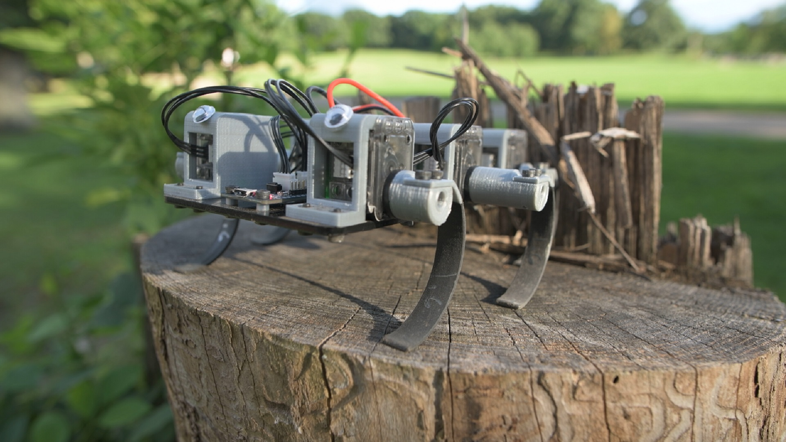

**MiniRHex: An Open-Source Hexapod Robot**

Contact: https://www.cmu.edu/me/robomechanicslab/contact.html

MiniRHex is a miniature-scale hexapod designed by the [Robomechanics Lab](https://www.cmu.edu/me/robomechanicslab/) based on the design of the cockroach-inspired [RHex](https://robotsguide.com/robots/rhex/). Notable features include a 3D printed chassis and legs for low cost construction and an intuitive software package that allows for highly-customizable control over the robot’s behavior. MiniRHex is designed to be an educational and outreach tool enabling students to experiment with a fully functional walking robot at a much lower cost. The low price tag lets research groups maintain a fleet of machines, allowing each student more hands-on interaction with the hardware. Possible educational principles include gait design and optimization, leg design and control, and mobile robot sensor incorporation.

# Setup Instructions
Building a MiniRhex requires access to a 3D printer. The links for off the shelf parts can be found below.

### Acquire Parts
The Parts List and Links to order can be found in [Parts List](https://github.com/robomechanics/MiniRHex/tree/master/HardwareList).

### Assemble Robot
Assembly Instructions are available at [Assembly Instructions](https://github.com/robomechanics/MiniRHex/tree/master/Assembly).

### Install Software
1. Install the Arduino IDE from https://www.arduino.cc/en/software
2. Open the Arduino IDE and under "Tools" select "Manage Libraries..."
   - Type "DynamixelShield" into the search bar
   - Select "Install" for the DynamixelShield library
3. Under "Tools" hover over "Board" and select "Boards Manager..."
   - Type "Arduino SAMD Boards" into the search bar
   - Select "Install" for the Arduino SAMD Boards (32-bits ARM Cortex-M0+)
4. (Non-developers) Download the MiniRHex repository from https://github.com/robomechanics/MiniRHex/archive/refs/heads/minirhex_redesign_2022.zip and extract the downloaded zip file
5. (Developers) Clone the MiniRHex repository from https://github.com/robomechanics/MiniRHex.git and checkout the "minirhex_redesign_2022" branch

### Configure Servo ID Numbers
The correct Dynamixel servo positions are:
- ID 1 = front left
- ID 2 = center left
- ID 3 = rear left
- ID 4 = front right
- ID 5 = center right
- ID 6 = rear right

To set the Dynamixel ID numbers, follow these steps:
1. Disconnect all Dynamixel servos except for the one in position 2
2. Open the Arduino IDE and check that under "Tools":
   - "Board" is set to "Arduino MKR WiFi 1010" (under "Arduino SAMD (32-bits ARM Cortex-M0+) Boards")
   - "Port" is set to the correct COM port, e.g. "COM# (Arduino MKR WiFi 1010)"
3. Select "File" > "Examples" > "DynamixelShield" > "Basic" > "id" to open the ID-setting example script
4. Find the line "new_id = DEFAULT_DXL_ID;" and delete it or comment it out: "// new_id = DEFAULT_DXL_ID;"
5. Find the line "new_id = 100;" and edit it to "new_id = 2;"
6. Upload code to the robot (the circular button near the top left with an arrow pointing to the right)
7. Open the Serial Monitor in the Arduino IDE (the circular button in the top right with a magnifying glass) and verify the ID has been changed
8. Unplug the Dynamixel and repeat from step 5 with the Dynamixel servos in positions 3, 4, 5 and 6 (setting "new_id = 3;" for ID 3, etc.)

# Operating Instructions
1. Connect the MiniRHex to your computer via the Micro USB port
2. Open MiniRHex.ino (located in the MiniRHex subfolder) in the Arduino IDE and check that under "Tools":
   - "Board" is set to "Arduino MKR WiFi 1010" (under "Arduino SAMD (32-bits ARM Cortex-M0+) Boards")
   - "Port" is set to the correct COM port, e.g. "COM# (Arduino MKR WiFi 1010)"
3. Upload code to the robot (the circular button near the top left with an arrow pointing to the right)
4. Insert the battery, fasten the velcro straps, and connect the battery cable
5. Open the Serial Monitor in the Arduino IDE (the circular button in the top right with a magnifying glass)
6. Type "w" into the text box and hit enter to start walking! ("q" to stop, "s" to reverse", "a" to turn left, "d" to turn right)
7. To modify the walking gait, go to the "gait_parameters.cpp" tab in the Arduino IDE and edit the parameters for each leg, then upload code again (see comments in the file for more details)
8. When finished, unplug the battery and store it in a fireproof container (never leave a battery in the robot!)

# Robot Specifications

# Useful Links
### Parts List
The part list can be found at [Parts List](https://github.com/robomechanics/MiniRHex/tree/master/HardwareList).
### MiniRHex Repository
The MiniRHex repository can be found at [MiniRHex Repository](https://github.com/robomechanics/MiniRHex.git).
### Cite MiniRHex
If referencing MiniRHex in a paper, please cite [this abstract](http://www.andrew.cmu.edu/user/amj1/papers/RSS2018ws_MiniRHex.pdf).
Use [this BibTeX](https://github.com/robomechanics/MiniRHex/blob/master/citation.txt) for citations:
> M. Barragan, N. Flowers, and A. M. Johnson. "MiniRHex: A Small, Open-source, Fully Programmable Walking Hexapod". In *Robotics: Science and Systems Workshop on ``Design and Control of Small Legged Robots''*, Pittsburgh, PA, June 2018.

### Images
See the [image gallery](https://robomechanics.github.io/MiniRHex/Images/) for more MiniRHex pictures.
        

### Videos
Check out the Robomechanics Lab [YouTube Page](https://www.youtube.com/watch?v=ldLXVDNCCzc&list=PLxHmBiQi0bD2aFgPKIrXhYXCCOGhTQmmk) for videos of MiniRHex in action!

# Contributors
MiniRHex was designed by the following people in the [Robomechanics Lab](https://www.cmu.edu/me/robomechanicslab/)
* Nikolai Flowers (BS ME '20)
* Barrett Werner (MS ME '19)
* Monica Barragan (BS ME '19)
* Cameron Selby (MS ME '18)
* Scott Phillips (BS ME '20)
* J. Joe Payne (Ph.D ME)
* Joe Norby (Ph.D ME '22)
* Catherine Pavlov (Ph.D ME '23)
* Aaron Johnson (Advisor)

